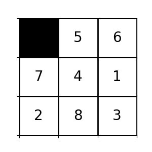
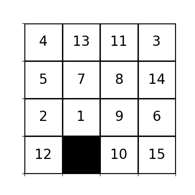
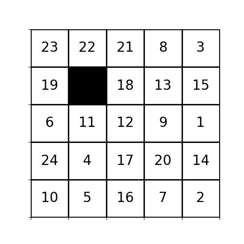

# CI2024_lab3

In this lab the goal was to design an algorithm to find a solution for the **n-puzzle** problem, that consists in reordering numbered tiles randomly placed in a square matrix with only one hole left free.

The problem is parametrized with `PUZZLE_DIM`, that represent the dimension of the square matrix.

The first state is initialized by creating an ordered matrix and then performing a certain number of allowed moves picked at random from the ones available at each step. In this experiment, the number of randomizing moves `RANDOMIZE_STEPS` was set to `100_000`, as it was reasonably high for most of the puzzle with a feasible solution.

## Configuration
The provided solution is based on the A* algorithm, where the *actual cost* of a state, intended as the number of moves taken to arrive to the state from the initial one, is not considered alone: indeed, also a **heuristic cost** is considered in combination to the actual cost in order to find the best solution in the smallest number of steps.

However, this approach was still slow for `PUZZLE_DIM>=3`, and a greater bias towards heuristic was necessary in order to achieve convergence in a feasible time, even if the solution found in this way become sub-optimal.

This tradeoff is managed by several parameters:
- `HEURISTIC_WEIGHT`: the initial weight of the heuristic; in case of true A* algorithm, must be set to 1;
- `HEURISTIC_WEIGHT_MSTEPS`: every times these number of cycles are runned, the bias towards heuristic increases, as it is multiplied by the factor `HEURISTIC_WEIGHT_MULT`
- `HEURISTIC_WEIGHT_MULT`: multiplication factor for the increase of heuristic weight;
- `MAX_HEURISTIC_WEIGHT`: maximum value for the heuristic weight, useful to set a limit to the heuristic in order not to underestimate the actual cost;

After several experiments, i found good the following configuration:
```python
PUZZLE_DIM = 5
RANDOMIZE_STEPS = 100_000

HEURISTIC_WEIGHT = 1.5
HEURISTIC_WEIGHT_MULT=1.05
HEURISTIC_WEIGHT_MSTEPS = 10**PUZZLE_DIM
MAX_HEURISTIC_WEIGHT = 3
```

## Encoding

Note that the encoding is fundamental to understand the problem.

Personally, i thought that choosing to the **"Hole"** (*empty tile*) as the moving entity rather than actual tiles, is more confortable for a unique and precise identification of positions and movements.

For this reason, internally:
- position are referred to positions of the Hole
- actions [`U`, `D`, `L`, `R`] represent the movements on the whole

However, for external communication, it is more user friendly to refer to actual tiles rather than the hole; for this reason i defined the functions:
- `hole_to_tile(haction:str)`: converts the action from hole to tile
- `movingTilePos(parent_state:State,tile_action:str)`: providing a (*parent*) state, the function retrieves the tuple-index of the position of the tile that will be moved by the action `tile_action` (*in tile encoding*).

These are used in the function `explain_path` to explain the whole path in a user-friendly list of commands.

## State Class

I defined the class `State` to efficiently manage states as **nodes of a Tree**, in order to solve the problem as a Tree search, pluggin in heuristics to perform the A*.

Therefore, the class `State` includes several variables:
- `.state`: actual state vector, saved as a *2D numpy array*
- `.parent`: reference to the *parent state* in the tree, or `None` if it correspond to the initial state
- `.depth`: current depth in the tree; it is cached in a variable as it is more efficient than computing it at runtime;
- `.last_move`: last move of the *hole* that lead to the current state, one of  [`U`, `D`, `L`, `R`], or `None` if the state corresponds to the initial state;

Then, all the required methods have been designed:
- constructor method
- static methods `getSolution()` and `getRandom()`, used to create particular instances as suggested by their name;
- `randomize(self, steps: int)`: perform `steps` random moves to shuffle the state, without expanding the tree;
- `zeropos(self)`: returns the tuple-indexes of the *hole*
- `available_actions(self)`: returns the list of all the actions allowed in the current state;
- `def swap(self, pos1, pos2)`: swap the positions of elements at the two tuple-indexes in the internal state (only used internally);
- `do_action(self, action: str,*,as_child=True)`: perform the action provided; if `as_child` is `True`, a child is generated from the current node and the action is applied on it, otherwise the action is applied directly to the current state without tree management (*useful for proper initialization*)
- `cost(self)`: actual cost of the current state, intended as the number of actions used to reach it; it corresponds to the *depth* of the tree;
- `manhattan_distance(self)`: compute *manhattan distance* for the current state matrix, as the sum of absolute distances `dxi` and `dyi` of each tile from its current position to its position in the goal state;
- `tot_cost(self)`: compute the total cost, using the `HEURISTIC_WEIGHT` parameter to properly weight the heuristic with respect to the actual cost;
- `is_solved(self)`: checks whether the current state corresponds to the goal state;
- special methods used for several purposes, like equalityh check (*it only include the state, not the parents!*), hashing, string representation, ...

## Priority Queue

I defined the class `InvPriorityQueue` to wrap priority queue mechanism in a convenient way, using an inverse mechanism (*popping the elements with lowest priority*).
In particular, key methods are:
- `append(self, item, inv_priority)`: adds an element;
- `popleft(self)`: pops the element with the lowest priority;

The class is then used in an inherited version, that is `StatePriorityQueue`, where the priority information is internally managed rather than providing it manually:
- `append(self, item: State)`: adds the item in the priority queue;

## A* algorithm

The core of A* algorithm is only a few lines of code:
- initialization:
    ```python
    frontier = StatePriorityQueue()
    frontier.append(state)
    visited = set()
    visited.add(state)
    ic(frontier.elements);
    ```
- running loop:
    ```python
    cycle=0
    while frontier:
        current_state = frontier.popleft()
        visited.add(current_state)
        if current_state.is_solved():
            print("Solved!")
            break
        actions = current_state.available_actions()
        for action in actions:
            new_state = current_state.do_action(action)
            if new_state not in visited:
                frontier.append(new_state)
        # ...
        # OTHER PARTS
        # ...

        cycle += 1
    ```
    A particular remark about the fact that the discovered states are not immediately evalued, as it is useful to prefilter them choosing only non-visited ones, avoiding to fill the *frontier* with invalid states that doesn't deserve a true evaluation.

However, there is a section inserted in the skipped part that is used for the dynamic adjustment of the `HEURISTIC_WEIGHT`, following the described logic, along with some meaningful print on the current state of the algorithm, especially interesting for long runs.

## Solution Evaluation

In the code i also included some functions to evaluate a solutions under different perspectives:
- `reconstruct_path(state: State)`: Reconstructs the path from the initial state to the given state from the hole point of view, simply climbing the tree up to the root;
- `expand_encoding(act:str)`: utility function to expand the name of directions;
- `explain_path(state: State)`: explains the path printing the actions the user would do (in tile encoding);
- `save_seq_as_gif(state:State, output_filename:str,*, frame_duration:int=500, end_pause_duration:int=2000)`: save the sequence as a gif in order to visualize it;

## Computed Statistics

Finally, here i provide my benchmark results for the 3 solutions:

| Puzzle Size | Time Taken for solution  | Quality (as # actions in solution) | Cost (as # actions evalued) |
|-------------|--------------------------|------------------------------------|-----------------------------|
| 3x3 | < 00'0.1" | 22 | 157 actions evalued |
| 4x4 | 00'19.8" | 58 | 85976 actions evalued |
| 5x5 | 14'19.1" | 156 | 2133251 actions evalued |


## Solution Gifs         
### 3x3 puzzle                       
    
### 4x4 puzzle                       

### 5x5 puzzle                       


